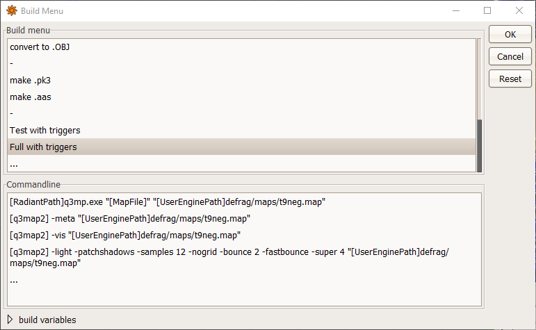

# What does this do?

TL;DR: Automatically adds triggers to all horizontal-ish surfaces on the map.

This utility parses a Quake3 map file, examines all the brushes, and searches for all faces that are tilted less than a specified angle and have a shader from a specified list. For each such face, a patch[^1] is created inside a trigger_multiple, which is then added to the map.

[^1]: or several patches if the face has more than 4 vertices

# Usage

## From command line:

```bash
q3mp.exe input_no_triggers.map output_with_triggers.map
```

## From NetRadiant (recommended):
1. Put `q3mp.exe` and `q3mp.cfg` in the same folder as `radiant.exe` (optional).

2. You will probably need to switch off build monitoring (Edit -> Preferences -> Settings -> Build -> uncheck "Enable Build Process Monitoring").

3. Add a custom build in Radiant (Build -> Customize...)

4. The first command of the custom build should execute `q3mp.exe` with the currently edited map as input and some other filename as output:
    ```
    [RadiantPath]q3mp.exe "[MapFile]" "[UserEnginePath]defrag/maps/newmap.map"
    ```
    If you didn't put `q3mp.exe` in the same folder as `radiant.exe`, you need to specify the full path instead of `[RadiantPath]`.

    If you are making a map called `newmap`, I suggest you do all your editing in a file called `newmap_no_triggers.map` and then use `newmap.map` as the output of q3mp.exe.

5. The rest of the commands (bsp & vis & light) can be copied from an existing build of your choice with a minor modification: replace `[MapFile]` with the file used as the output of q3mp.exe.

   An example build can look like this: 

6. Save the custom build and run it.

Next time, you just press `F5` as usual and enjoy not having to deal with triggers manually :) You just edit `newmap_no_triggers.map` as usual. When you run the build, the first command adds triggers to the map and saves it as `newmap.map`. Then the rest of the commands compile `newmap.map` as usual.

# Configuration

The configuration file `q3mp.cfg` is a text file that uses the same syntax as map files.

You can find the description of all settings in the [q3mp.cfg file itself](q3mp.cfg).

Note: the patches are added with an offset of 1 unit from the original face. This distance is not configurable yet (but it can be easily added if needed).
